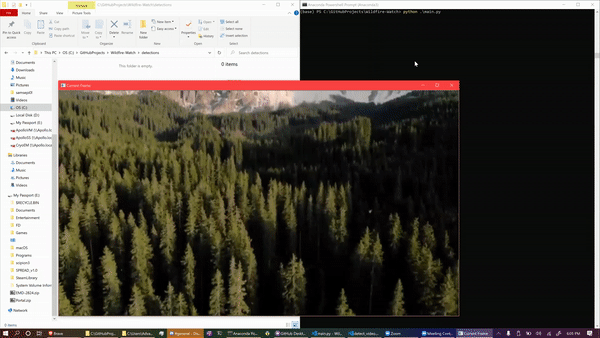

# Wildfire-Watch
A scalable wildfire fire detection framework, written in Python.

[](LICENSE)

## Getting Started
### Installation
#### Conda (Recommended)
```bash
conda env create -f requirements.yml
conda activate WFW
```

#### Pip
```bash
pip install -r requirements.txt
```

### Flags
Wildfire-Watch has five flags a user can define, listed as follows:
```bash
video - A path to an OpenCV video input, which is set to 0 for a local webcam
capRate - Sets a capture rate. For every specified number of frames, a Google Vision API call will be made
info - determines if detection information will be logged to the console
output - determines if forest fire detections will be saved as individual images
Display - determines if each analyzed frame is displayed, for debugging purposes
```
### Input
An input video must be supplied for Wildfire Watch to analyze. Every 100 frames of the video will be run through Google Cloud VISION to search for wildfires.

### Output
You can find the output detection(s) of forest fires in the detections folder.
Each detection is formatted as follows: 
```bash
FRAMENUMBER_LATITUDE_LONGITUDE.png 
```
where FRAMENUMBER is the current frame number. LATITUDE and LONGITUDE denote the latitude and longitude generated from an IP address.

## Resulting Images
You can find the outputted detection image(s) in the detections folder.

#### Wildfire Detected
<p align="center"></p>

#### No Wildfire Detected
<p align="center"></p>


## Developer Notes
All object identification uses Google Cloud's VISION API. The pipeline can be exported across multiple systems with minimal changes. 

# Sample pipeline
To get started, specify a camera input using the flags in `main.py`, then run the excecutible using `python ./main.py`. You can view the frames determined to contain wildfires in them in the detections folder.

Wildfire-Watch is Open Source. You can find the code on our [GitHub repository](https://github.com/20af02/Wildfire-Watch/).
